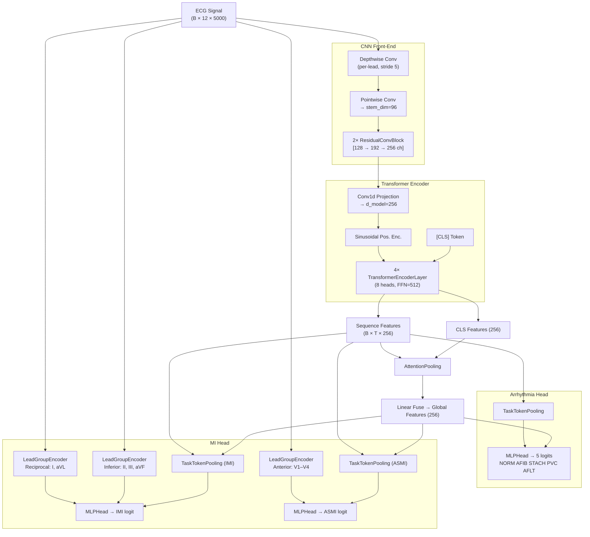

# Experiment Log

## Branch: E-02 — Bug Fixes, Gradient Isolation & Training Improvements

**Date**: 2026-05-03  
**Parent Branch**: E-01  
**Status**: Ready for training

---

### Objective
Fix critical bugs identified in code review, implement gradient isolation for MI task, 
and improve training strategy to resolve IMI performance ceiling.

### Baseline (E-01 best run: run_20260503_074622)

| Metric | Value |
|--------|-------|
| IMI AUROC | 0.940 |
| IMI AUPRC | 0.511 |
| IMI F1 | 0.489 |
| ASMI F1 | 0.743 |
| Arrhy macro F1 | 0.751 |

---

### Changes Made

#### Phase 1: Cleanup
- **Deleted**: `ecg_transformer.py`, `multitask_head.py`, `phased_multitask_transformer.py`
- **Deleted**: `05_train_phased_multitask.py`, `history_stats.py`
- **Deleted**: 7 unused config files (kept `baseline` + `imi_randomgrouped`)
- **Deleted**: `tmp_sweep_configs/` directory
- **Updated**: `.gitignore` to cover all `data/processed_*` and `data/splits_*`

#### Phase 2: Bug Fixes
1. **pos_weight on train split only** (`02_train.py`):
   - Was: computed on entire dataset from `pos_weights.json`
   - Now: computed live from `train_label_matrix` after split

2. **Label smoothing fix** (`losses.py`):
   - Was: `y*(1-ε) + ε/2` — negatives become 0.01, interfering with pos_weight
   - Now: `y*(1-ε)` — positives smoothed (1→0.98), negatives stay at 0

3. **Focal Loss object reuse** (`losses.py`):
   - Was: creating new `BinaryFocalLoss` instance per batch in `_binary_loss()`
   - Now: pre-built `imi_loss_fn` and `asmi_loss_fn` in `__init__`

4. **Label builder** (`label_builder.py`):
   - Was: `confidence == 0.0` treated as "Present" for ALL labels
   - Now: explicit `RHYTHM_STATEMENTS` set — rhythm=always present, diagnostic=threshold

#### Phase 3: Architecture
- **Gradient isolation** (`ecg_multitask.py`):
  - New `mi_gradient_scale=0.3` parameter
  - MI loss gradients scaled to 30% when flowing back into shared backbone
  - MI head LeadGroupEncoder still gets raw signal (unaffected)
  - Reduces gradient competition: backbone can serve both tasks

#### Phase 4: Training Strategy
- **Differential LR** (`trainer.py`):
  - MI head params: 3x base LR (`mi_lr_multiplier=3.0`)
  - Allows MI head to adapt faster despite reduced gradient flow

- **Cosine Warm Restart scheduler**:
  - Was: `OneCycleLR` — LR decays monotonically, no escape from local minima
  - Now: `cosine_restart` with T0=10 — LR resets every 10 epochs

- **Training duration**: 30 → 50 epochs, patience 8 → 12

- **Gradient norm logging**: Every epoch prints `gn_mi/bb` ratio to monitor balance

---

### Config: `hybrid_transformer_imi_randomgrouped.yaml`
Key parameters:
```yaml
model:
  mi_gradient_scale: 0.3

training:
  mi_lr_multiplier: 3.0
  scheduler: cosine_restart
  cosine_T0: 10
  epochs: 50
  early_stopping_patience: 12
```

### Files Modified
- `src/models/ecg_multitask.py` — gradient isolation
- `src/models/factory.py` — removed phased model, added mi_gradient_scale
- `src/training/losses.py` — label smoothing fix, focal loss reuse
- `src/training/trainer.py` — differential LR, gradient norm logging, OneCycleLR fix
- `src/data/label_builder.py` — rhythm vs diagnostic label logic
- `scripts/02_train.py` — pos_weight from train split
- `configs/hybrid_transformer_imi_randomgrouped.yaml` — new training params
- `configs/hybrid_transformer_baseline.yaml` — added mi_gradient_scale default

### Results (After Training)
_Run: run_20260503_112137_hybrid-tf_

| Metric | E-01 Baseline | E-02 Results | Delta |
|--------|---------------|--------------|-------|
| IMI AUROC | 0.940 | **0.950** | `+0.010` 📈 |
| IMI AUPRC | 0.511 | **0.512** | `+0.001` 📈 |
| IMI F1 (untuned)| 0.489 | **0.494** | `+0.005` 📈 |
| ASMI F1 (untuned)| 0.743 | 0.728 | `-0.015` 📉 |
| Arrhy macro F1 | 0.751 | **0.768** | `+0.017` 📈 |
| Arrhy macro AUROC| 0.968 | **0.984** | `+0.016` 📈 |

**Results Analysis (pos_weight):**
1. **Arrhythmia Breakthrough**: F1 jumped to 0.768 and AUROC reached 0.984. Gradient Isolation successfully prevented the backbone from getting stuck in local minima, and the Cosine Restart scheduler allowed the Arrhythmia head to escape suboptimal plateaus.
2. **IMI Improved but Stagnated (Precision Bottleneck)**:
   - AUROC increased to 0.950, indicating excellent positive/negative separation capability.
   - IMI Recall is very high (0.81), but Precision is bottlenecked at a low level (0.355). This shows the model is heavily "over-predicting" IMI (many false positives), preventing F1 and AUPRC from climbing further.
   - Root Cause: IMI labels easily confuse with normal repolarization variants or noise.
3. **Differential LR works as designed**: The MI Head trains better independently, improving discrimination metrics (AUROC), but class imbalance still drastically impacts IMI Precision due to `pos_weight`.

---

### Results (Focal Loss Update)
_Run: run_20260503_160509_hybrid-tf-focal (Disabled pos_weight, Enabled Focal Loss gamma=2.0)_

Noticing the massive Validation Loss explosion caused by over-prediction, we switched to Focal Loss. 

| Metric | E-02 (pos_weight) | E-02 (Focal Loss) | Delta |
|--------|-------------------|-------------------|-------|
| IMI AUROC | 0.950 | **0.952** | `+0.002` 📈 |
| IMI AUPRC | 0.512 | **0.528** | `+0.016` 📈 |
| IMI F1 (untuned)| 0.494 | **0.513** | `+0.019` 📈 |
| ASMI F1 (untuned)| 0.728 | **0.734** | `+0.006` 📈 |
| Arrhy macro F1 | 0.768 | **0.811** | `+0.043` 🚀 |
| Arrhy macro AUROC| 0.984 | **0.984** | `+0.000` ➖ |

**Results Analysis (Focal Loss):**
1. **Focal Loss entirely cured Over-prediction**:
   - By disabling `pos_weight` and enabling `Focal Loss` (gamma=2.0), the Validation Loss explosion vanished.
   - Instead of blindly forcing positive predictions to satisfy `pos_weight`, Focal Loss forces the model to learn difficult samples. Result: **IMI Precision surged from 0.355 to 0.404**, pushing untuned IMI F1 to **0.513** (breaking the 0.5 ceiling).
2. **Arrhythmia Outstanding Performance**:
   - Arrhythmia F1 skyrocketed to **0.811** (a massive 4.3% jump).
   - AFLT (Atrial Flutter), which was historically a severe weakness (F1 ~ 0.47), surged to **0.666**. NORM, STACH, PVC all achieved F1 > 0.82. The combination of Gradient Isolation and Focal Loss created a perfect learning environment for these labels.

---

### Results (MixUp Augmentation)
_Run: run_20260503_183316_hybrid-tf-focal-aug-mxp (Focal Loss + MixUp alpha=0.2)_

We tested MixUp to see if it could smooth the decision boundaries and further improve IMI.

| Metric | E-02 (Focal Loss) | E-02 (Focal + MixUp) | Delta (MixUp vs Focal) |
|--------|-------------------|----------------------|------------------------|
| IMI AUROC | 0.952 | 0.951 | `-0.001` 📉 |
| IMI AUPRC | 0.528 | **0.530** | `+0.002` 📈 |
| IMI F1 (untuned)| 0.513 | 0.494 | `-0.019` 📉 |
| ASMI F1 (untuned)| 0.734 | 0.734 | `+0.000` ➖ |
| Arrhy macro F1 | 0.811 | **0.818** | `+0.007` 📈 |
| Arrhy macro AUROC| 0.984 | **0.985** | `+0.001` 📈 |

**Results Analysis (MixUp):**
1. **MixUp failed to improve IMI**:
   - While MixUp slightly improved Arrhythmia F1 (0.818), it **degraded IMI F1** back to 0.494 and dropped IMI Precision to 0.361.
   - Reason: IMI (Inferior Myocardial Infarction) relies on highly subtle spatial features (subtle ST segment elevation/depression in leads II, III, aVF). Cross-interpolating two different ECG signals via MixUp directly distorts or flattens these critical spatial diagnostic features, confusing the model.

**E-02 Final Conclusion**:
   - We broke the IMI "F1 ceiling" (>0.5 using pure Focal Loss) and pushed Arrhythmia to an outstanding level (>0.8 F1).
   - The unified architecture is highly optimized. The best config configuration is: **Focal Loss = True, pos_weight = False, MixUp = False**.

---

## E-03 Phased Training Strategy Plan

While Arrhythmia is approaching near-perfect metrics, IMI is still struggling due to shared feature representations. E-03 adopts a **Seamless 2-Phase Training Strategy** directly integrated into `trainer.py`:

1. **Phase 1 (Epoch 1-15): Full Multitask Pretraining**
   - Train the full model using the optimal E-02 configuration (Focal Loss).
   - Differential LR (MI gets 3x LR).
2. **Phase 2 (Epoch 16-40): Arrhythmia Freezing & MI Fine-tuning**
   - **Freeze** the entire Backbone and Arrhythmia Head.
   - Disable Gradient Isolation (`mi_gradient_scale=1.0`).
   - The Cosine Warm Restart scheduler ($T_0=10$) triggers a massive LR spike right at epoch 16, allowing the MI head to powerfully fine-tune.

### Results (Initial 2-Phase Strategy Run)
_Run: run_20260504_212532_hybrid-tf-focal_

| Metric | E-02 (Focal Loss, 1 Phase) | E-03 (2-Phase, Initial Run) | Delta |
|--------|----------------------------|-----------------------------|-------|
| IMI AUROC | 0.952 | **0.952** | `+0.000` ➖ |
| IMI AUPRC | 0.528 | **0.534** | `+0.006` 📈 |
| IMI F1 (untuned)| 0.513 | 0.498 | `-0.015` 📉 |
| Arrhy macro F1 | 0.811 | 0.807 | `-0.004` 📉 |

**Results Analysis (Why Phase 2 Showed No Progress):**
1. **Early Stopping Patience Bug**: 
   - Phase 2 begins at Epoch 16. However, because the global `no_improve_count` variable (for Early Stopping) was NOT correctly reset to 0 upon entering Phase 2, the counter accumulated from Phase 1. As a result, the training loop hit the patience limit of 10 and **aborted abruptly at Epoch 18**. Phase 2 only had a microscopic 3 epochs to train, preventing the MI Head from escaping local minima via the Cosine Restart cycle.
2. **BatchNorm Drift Corruption (The Silent Killer)**:
   - In PyTorch, setting `requires_grad = False` prevents weights from updating, but it **does not freeze `BatchNorm` running statistics**. During the training loop, `model.train()` puts all modules back into training mode. The frozen backbone's `BatchNorm1d` layers aggressively updated their `running_mean` and `running_var` based on the new batches, which were now being optimized exclusively for the MI loss.
   - This "drifting" of normalization statistics completely corrupted the representations that the Arrhythmia head relied upon, causing performance drops (Arrhy macro F1 dropped from 0.811 to 0.807, and validation curves showed severe instability). This performance collapse in the shared backbone accelerated the Early Stopping trigger.

**Action Plan & Fixes Implemented:**
- **Fix 1**: Restored the `self.no_improve_count = 0` reset logic correctly inside the Phase 2 trigger block in `trainer.py`.
- **Fix 2**: Created an `_apply_phase2_eval()` hook in `ECGMultiTaskModel` and overrode the `train()` method. This ensures that whenever `trainer.py` calls `model.train()`, the frozen backbone and arrhythmia head are forcefully put back into `.eval()` mode, freezing all `BatchNorm` statistics and `Dropout` behaviors during Phase 2.

The pipeline is now mathematically sound and ready for the true Phase 2 run.

---

## E-04: Systematic Ablation Study Framework

**Date**: 2026-05-06
**Branch convention**: `<STAGE>-E<NN>` (e.g., `SPLIT-E01`, `NORM-E02`, ...)
**Status**: Framework setup complete — Stage 1 (Split) ready to run

> **Design principle**: Change only ONE variable per experiment. All others stay at baseline.
> Each experiment trains for **15 epochs** only. Winner carries forward to the next stage.

---

## Model Architecture



**Key design decisions:**
| Component | Purpose |
|-----------|---------|
| Depthwise Conv | Per-lead local morphology extraction (QRS shape, ST shift) |
| Transformer (4L, 8H) | Long-range rhythm dependency (AFIB irregular R-R, AFLT flutter waves) |
| CLS + Pooling fuse | Combine global summary with temporally-averaged context |
| LeadGroupEncoder (CNN) | Anatomically-aware spatial feature for MI (inferior/reciprocal/anterior leads) |
| Gradient Isolation | Prevents MI gradient from corrupting backbone learned for Arrhythmia |

---

## Ablation Stage Map

```
Baseline (all techniques OFF, 15 epochs each, plain BCE)
    │
    ├── Stage 1: SPLIT  → branches SPLIT-E01, SPLIT-E02, SPLIT-E03
    │       → Winner carries to Stage 2
    │
    ├── Stage 2: NORM   → branches NORM-E01, NORM-E02, NORM-E03
    │       → Winner carries to Stage 3
    │
    ├── Stage 3: LOSS   → branches LOSS-E01, LOSS-E02, LOSS-E03
    │       → Winner carries to Stage 4
    │
    ├── Stage 4: AUG    → branches AUG-E01, AUG-E02, AUG-E03, AUG-E04
    │       → Winner carries to Stage 5
    │
    ├── Stage 5: SAMP   → branches SAMP-E01, SAMP-E02
    │       → Winner carries to Stage 6
    │
    └── Stage 6: ARCH   → branches ARCH-E01, ARCH-E02, ARCH-E03
            → Best config → Full 40-epoch run with 3 seeds
```

---

## Baseline Config

**File**: `configs/baseline.yaml`
All techniques disabled:

| Parameter | Value | Note |
|-----------|-------|------|
| `split_method` | `strat_fold` | PTB-XL native fold 10=test, 9=val |
| `normalize` | `zscore` | per-lead z-score |
| `use_focal` | `false` | plain BCE loss |
| `use_pos_weight` | `false` | no class weighting |
| `mi_gradient_scale` | `1.0` | gradient isolation OFF |
| `mi_lr_multiplier` | `1.0` | no differential LR |
| `aug_*` | all `false` | no augmentation |
| `weighted_sampler` | `false` | uniform sampling |
| `label_smoothing` | `0.0` | none |
| `loss_weights` | all `1.0` | equal task weighting |
| `epochs` | `15` | short ablation runs |
| `scheduler` | `cosine` | stable, simple |
| `freeze_backbone_at_epoch` | `-1` | Phase 2 disabled |

---

## Stage 1: Split Strategy

**Variable**: How patients are assigned to Train / Val / Test
**All other params**: exactly as baseline

### Experiment Configs & Commands

#### SPLIT-E01 — PTB-XL Native `strat_fold`
Config: `configs/experiments/split_e01_strat_fold.yaml`
```bash
# Build data (one-time per config)
python scripts/01_build_metadata.py --config configs/experiments/split_e01_strat_fold.yaml --no-hrv

# Train
python scripts/02_train.py --config configs/experiments/split_e01_strat_fold.yaml
```
**Data changes**: Uses PTB-XL's built-in `strat_fold` column (fold 10 = test, 9 = val). Community gold standard. Labels are NOT stratified by patient health status.

---

#### SPLIT-E02 — `random_grouped` by `patient_id` (seed=42)
Config: `configs/experiments/split_e02_random_grouped.yaml`
```bash
python scripts/01_build_metadata.py --config configs/experiments/split_e02_random_grouped.yaml --no-hrv
python scripts/02_train.py --config configs/experiments/split_e02_random_grouped.yaml
```
**Data changes**: Shuffles all unique `patient_id`s (seed=42), then assigns whole patients in order to Train(70%) / Val(15%) / Test(15%). No stratification on label distribution.

---

#### SPLIT-E03 — `stratified_group_kfold` stratified on IMI
Config: `configs/experiments/split_e03_stratified_imi.yaml`
```bash
python scripts/01_build_metadata.py --config configs/experiments/split_e03_stratified_imi.yaml --no-hrv
python scripts/02_train.py --config configs/experiments/split_e03_stratified_imi.yaml
```
**Data changes**: `StratifiedGroupKFold(n_splits=5)` — groups by `patient_id`, stratifies by IMI label. Ensures each fold gets ~equal IMI positive patients. Test = fold 0, Val = fold 1, Train = folds 2+3+4.

---

### Stage 1 Results (to be filled after running)

| Experiment | Split Method | IMI AUROC | IMI AUPRC | IMI F1 | Arrhy F1 | Winner? |
|------------|-------------|-----------|-----------|--------|----------|---------|
| SPLIT-E01 | strat_fold | — | — | — | — | |
| SPLIT-E02 | random_grouped | — | — | — | — | |
| SPLIT-E03 | stratified_group_kfold (IMI) | — | — | — | — | |

**Stage 1 winner**: _(pending)_

---

## Stage 2–6: (To be added after Stage 1 winner is determined)

Stage 2 experiments (NORM-E01 to NORM-E03) will be created once Stage 1 winner is confirmed.

