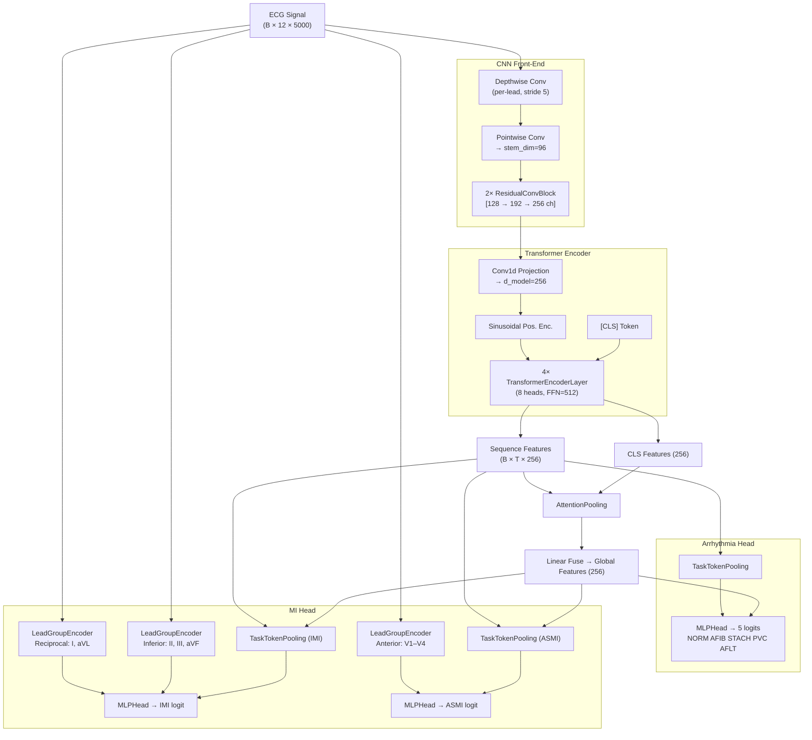

## E-04: Systematic Ablation Study Framework

**Date**: 2026-05-06
**Branch convention**: `<STAGE>-E<NN>` (e.g., `SPLIT-E01`, `NORM-E02`, ...)
**Status**: Framework setup complete — Stage 1 (Split) ready to run

> **Design principle**: Change only ONE variable per experiment. All others stay at baseline.
> Each experiment trains for **15 epochs** only. Winner carries forward to the next stage.

---

## Model Architecture



**Key design decisions:**
| Component | Purpose |
|-----------|---------|
| Depthwise Conv | Per-lead local morphology extraction (QRS shape, ST shift) |
| Transformer (4L, 8H) | Long-range rhythm dependency (AFIB irregular R-R, AFLT flutter waves) |
| CLS + Pooling fuse | Combine global summary with temporally-averaged context |
| LeadGroupEncoder (CNN) | Anatomically-aware spatial feature for MI (inferior/reciprocal/anterior leads) |
| Gradient Isolation | Prevents MI gradient from corrupting backbone learned for Arrhythmia |

---

## Ablation Stage Map

```
Baseline (all techniques OFF, 15 epochs each, plain BCE)
    │
    ├── Stage 1: SPLIT  → branches SPLIT-E01, SPLIT-E02, SPLIT-E03
    │       → Winner carries to Stage 2
    │
    ├── Stage 2: NORM   → branches NORM-E01, NORM-E02, NORM-E03
    │       → Winner carries to Stage 3
    │
    ├── Stage 3: LOSS   → branches LOSS-E01, LOSS-E02, LOSS-E03
    │       → Winner carries to Stage 4
    │
    ├── Stage 4: AUG    → branches AUG-E01, AUG-E02, AUG-E03, AUG-E04
    │       → Winner carries to Stage 5
    │
    ├── Stage 5: SAMP   → branches SAMP-E01, SAMP-E02
    │       → Winner carries to Stage 6
    │
    └── Stage 6: ARCH   → branches ARCH-E01, ARCH-E02, ARCH-E03
            → Best config → Full 40-epoch run with 3 seeds
```

---

## Baseline Config

**File**: `configs/baseline.yaml`
All techniques disabled:

| Parameter | Value | Note |
|-----------|-------|------|
| `split_method` | `strat_fold` | PTB-XL native fold 10=test, 9=val |
| `normalize` | `zscore` | per-lead z-score |
| `use_focal` | `false` | plain BCE loss |
| `use_pos_weight` | `false` | no class weighting |
| `mi_gradient_scale` | `1.0` | gradient isolation OFF |
| `mi_lr_multiplier` | `1.0` | no differential LR |
| `aug_*` | all `false` | no augmentation |
| `weighted_sampler` | `false` | uniform sampling |
| `label_smoothing` | `0.0` | none |
| `loss_weights` | all `1.0` | equal task weighting |
| `epochs` | `15` | short ablation runs |
| `scheduler` | `cosine` | stable, simple |
| `freeze_backbone_at_epoch` | `-1` | Phase 2 disabled |

---

## Stage 1: Split Strategy

**Variable**: How patients are assigned to Train / Val / Test
**All other params**: exactly as baseline

### Experiment Configs & Commands

#### SPLIT-E01 — PTB-XL Native `strat_fold`
Config: `configs/experiments/split_e01_strat_fold.yaml`
```bash
# Build data (one-time per config)
python scripts/01_build_metadata.py --config configs/experiments/split_e01_strat_fold.yaml --no-hrv

# Train
python scripts/02_train.py --config configs/experiments/split_e01_strat_fold.yaml
```
**Data changes**: Uses PTB-XL's built-in `strat_fold` column (fold 10 = test, 9 = val). Community gold standard. Labels are NOT stratified by patient health status.

---

#### SPLIT-E02 — `random_grouped` by `patient_id` (seed=42)
Config: `configs/experiments/split_e02_random_grouped.yaml`
```bash
python scripts/01_build_metadata.py --config configs/experiments/split_e02_random_grouped.yaml --no-hrv
python scripts/02_train.py --config configs/experiments/split_e02_random_grouped.yaml
```
**Data changes**: Shuffles all unique `patient_id`s (seed=42), then assigns whole patients in order to Train(70%) / Val(15%) / Test(15%). No stratification on label distribution.

---

#### SPLIT-E03 — `stratified_group_kfold` stratified on IMI
Config: `configs/experiments/split_e03_stratified_imi.yaml`
```bash
python scripts/01_build_metadata.py --config configs/experiments/split_e03_stratified_imi.yaml --no-hrv
python scripts/02_train.py --config configs/experiments/split_e03_stratified_imi.yaml
```
**Data changes**: `StratifiedGroupKFold(n_splits=5)` — groups by `patient_id`, stratifies by IMI label. Ensures each fold gets ~equal IMI positive patients. Test = fold 0, Val = fold 1, Train = folds 2+3+4.

---

### Stage 1 Results

| Experiment | Split Method | IMI AUROC | IMI AUPRC | IMI F1 | Arrhy macro F1 | Folder | Winner? |
|------------|-------------|-----------|-----------|--------|----------------|--------|---------|
| SPLIT-E01 | `strat_fold` | 0.937 | 0.457 | 0.456 | 0.733 | `run_20260506_231153_hybrid-tf` | |
| SPLIT-E02 | `random_grouped` | 0.947 | **0.519** | **0.517** | **0.828** | `run_20260507_003151_hybrid-tf` | ✅ |
| SPLIT-E03 | `stratified_group_kfold (IMI)` | **0.959** | 0.506 | 0.558 | 0.768 | `run_20260507_013801_hybrid-tf` | |

**Stage 1 winner**: **SPLIT-E02** (`random_grouped`, seed=42)

**Analysis:**
1. **SPLIT-E01 (strat_fold) performed worst** — IMI AUPRC only 0.457, Arrhy F1 only 0.733. PTB-XL's built-in fold assigns patients across 10 folds designed for full 10-fold CV, meaning fold 10 (test) may have a skewed IMI distribution in a 1-fold evaluation scenario.
2. **SPLIT-E02 (random_grouped) is the clear winner** — Best IMI AUPRC (0.519) and Arrhy macro F1 (0.828). The 70/15/15 patient-grouped random split naturally produces a balanced training set size and representative test split.
3. **SPLIT-E03 (stratified on IMI)** — Highest IMI AUROC (0.959) and IMI F1 (0.558) but Arrhy F1 dropped to 0.768 vs SPLIT-E02's 0.828. Stratifying only on IMI creates a lopsided fold structure that hurts Arrhythmia. AUPRC (0.506) is also lower than E02. Not the right tradeoff.

→ **SPLIT-E02 config carries forward** to Stage 2 (Normalization).

---

## Stage 2–6: (To be added after Stage 1 winner is determined)

Stage 2 experiments (NORM-E01 to NORM-E03) will be created once Stage 1 winner is confirmed.


