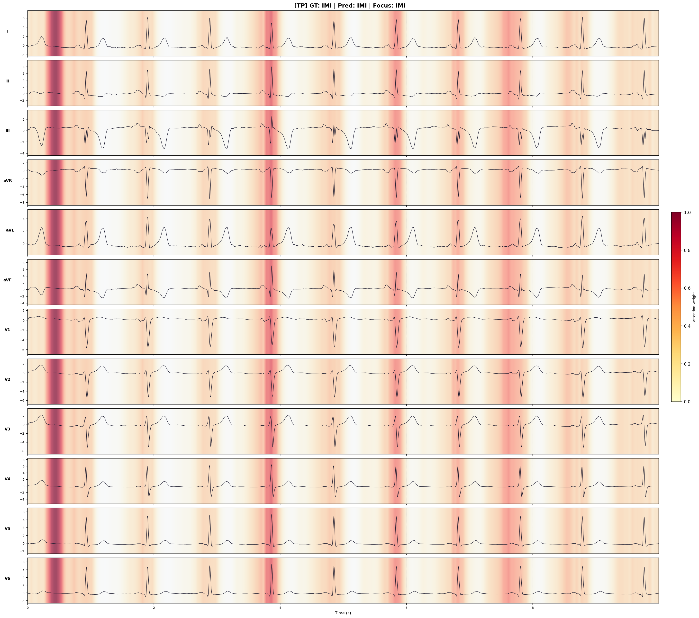

# ECG Multi-Task Transformer

A deep learning project for 12-lead ECG analysis on the PTB-XL dataset utilizing a Hybrid Transformer architecture and multi-task learning.

## Directory Structure
```
ECG_HRV/
├── data/
│   ├── raw/PTB-XL/          ← Raw dataset
│   ├── processed/           ← Preprocessed metadata and matrices
│   └── splits/              ← Train/val/test split indices
├── src/
│   ├── data/                ← Data loading, preprocessing, and label extraction
│   ├── models/              ← Hybrid Transformer & Multi-task heads
│   ├── training/            ← Custom training loop & loss functions
│   └── utils/               ← Evaluation metrics
├── configs/                 
│   └── experiments/         ← Configuration files (Ablation, X-Val, Final)
├── scripts/                 ← Executable scripts for pipeline stages
└── checkpoints/             ← Auto-generated model checkpoints
```

## Installation

```bash
pip install -r requirements.txt
```

## Usage

### 1. Data Preprocessing (Required)
```bash
# Full preprocessing (Includes HRV, ~30 mins)
python scripts/01_build_metadata.py

# Without HRV (Faster, ~5 mins)
python scripts/01_build_metadata.py --no-hrv

# Quick test (100 samples)
python scripts/01_build_metadata.py --max-samples 100 --no-hrv
```

### 2. Training
```bash
# Train using a specific configuration
python scripts/02_train.py --config configs/experiments/final/final_e01_seed42.yaml

# Debug mode (200 samples, 3 epochs)
python scripts/02_train.py --config configs/experiments/final/final_e01_seed42.yaml --debug

# Override hyperparameters from CLI
python scripts/02_train.py --config configs/experiments/final/final_e01_seed42.yaml --epochs 30 --batch-size 32 --lr 5e-5

# Resume from checkpoint
python scripts/02_train.py --config configs/experiments/final/final_e01_seed42.yaml --resume checkpoints/run_xxx/epoch_010.pth
```

## Supported Labels

| Label | Task | Description |
|-------|------|-----------|
| NORM  | normal | Normal ECG |
| AFIB  | arrhythmia | Atrial Fibrillation |
| STACH | arrhythmia | Sinus Tachycardia |
| SBRAD | arrhythmia | Sinus Bradycardia |
| AFLT  | arrhythmia | Atrial Flutter |
| IMI   | mi | Inferior Myocardial Infarction |
| ASMI  | mi | Anteroseptal Myocardial Infarction |

## Model Architecture

```
Input (B, 12, 1000)
  → PatchEmbedding (patch_size=25 → 40 patches × 12 leads)
  → Linear projection (300 → d_model=128)
  → [CLS] token + Positional Encoding
  → TransformerEncoder (4 layers, 4 heads, Pre-LN)
  → CLS token (B, 128)
      ├── Arrhythmia Head → (B, 5) logits
      ├── MI Head         → (B, 2) logits
      └── HRV Head        → (B, 3) [rmssd, sdnn, mean_hr]
```

## Outputs (checkpoints/)
- `best_model.pth`: Best validation AUROC checkpoint.
- `epoch_XXX.pth`: Periodic checkpoints.
- `history.json`: Epoch-wise training and validation metrics.
- `test_metrics.json`: Final evaluation results.

## Evaluation Results

The table below presents the detailed performance of our best configuration (Seed 123, run_20260516_145231_hybrid-tf-aug) on the Test Set, including per-class metrics and macro averages for each group:

| Task / Group | Class / Subgroup | F1-Score | Precision | Recall | AUROC | AUPRC |
| :--- | :--- | :---: | :---: | :---: | :---: | :---: |
| **Arrhythmia** | NORM | 0.862 | 0.829 | 0.898 | 0.956 | 0.918 |
| | AFIB | 0.872 | 0.872 | 0.872 | 0.992 | 0.889 |
| | STACH | 0.847 | 0.829 | 0.866 | 0.993 | 0.847 |
| | PVC | 0.859 | 0.771 | 0.969 | 0.981 | 0.858 |
| | AFLT | 0.692 | 0.692 | 0.692 | 0.978 | 0.716 |
| | **Arrhythmia Average (Macro)** | **0.826** | **0.798** | **0.859** | **0.980** | **0.846** |
| **Myocardial Infarction (MI)** | IMI | 0.553 | 0.438 | 0.751 | 0.951 | 0.533 |
| | ASMI | 0.759 | 0.754 | 0.763 | 0.977 | 0.855 |
| | **MI Average (Macro)** | **0.656** | **0.596** | **0.757** | **0.964** | **0.694** |

## Explainable AI (XAI)

The XAI module extracts attention weights from the Transformer Encoder to generate heatmaps, highlighting the specific ECG segments the model focuses on for its predictions.

Example of an attention heatmap generated for an Inferior Myocardial Infarction detection case (True Positive):



```bash
# Generate XAI heatmaps for the test set, segregated by TP/FP
python scripts/16_xai_explainer.py \
    --checkpoint checkpoints/run_YYYYMMDD_HHMMSS \
    --config configs/experiments/final/final_e01_seed42.yaml \
    --split test \
    --max-per-class 5 \
    --max-total 50
```

Heatmaps are automatically saved to `artifacts/xai/` with the following structure:
- `artifacts/xai/TP/{label}/`: **True Positives** (Correct predictions).
- `artifacts/xai/FP/{label}/`: **False Positives** (Incorrect predictions).
